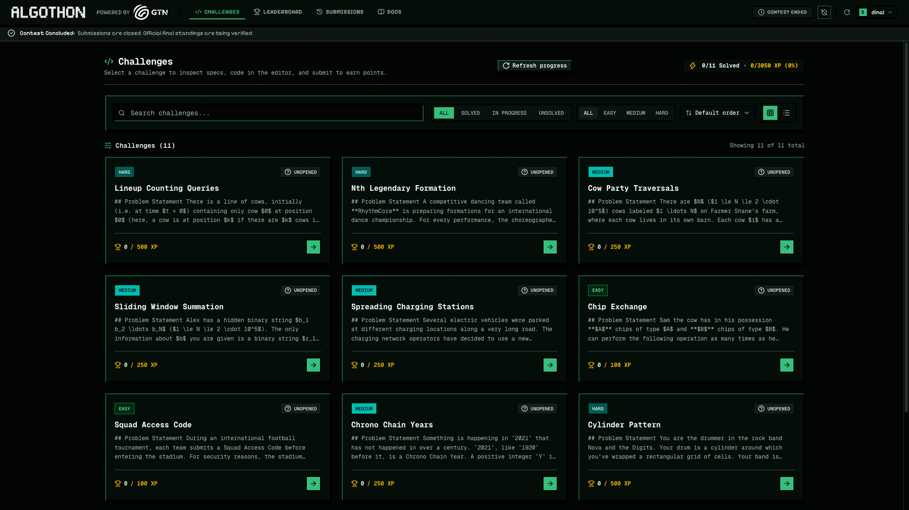
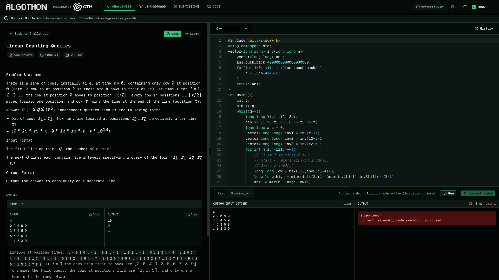
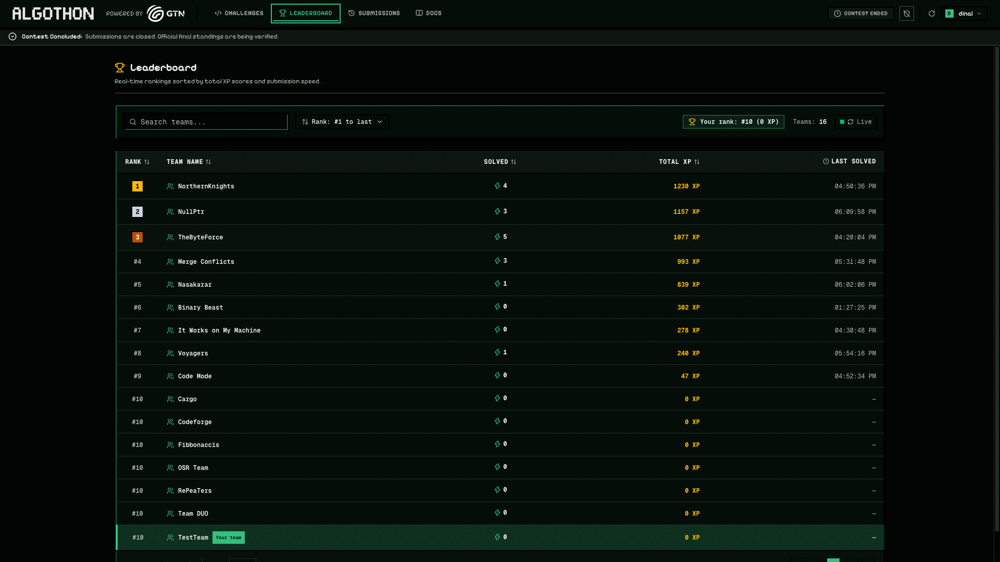
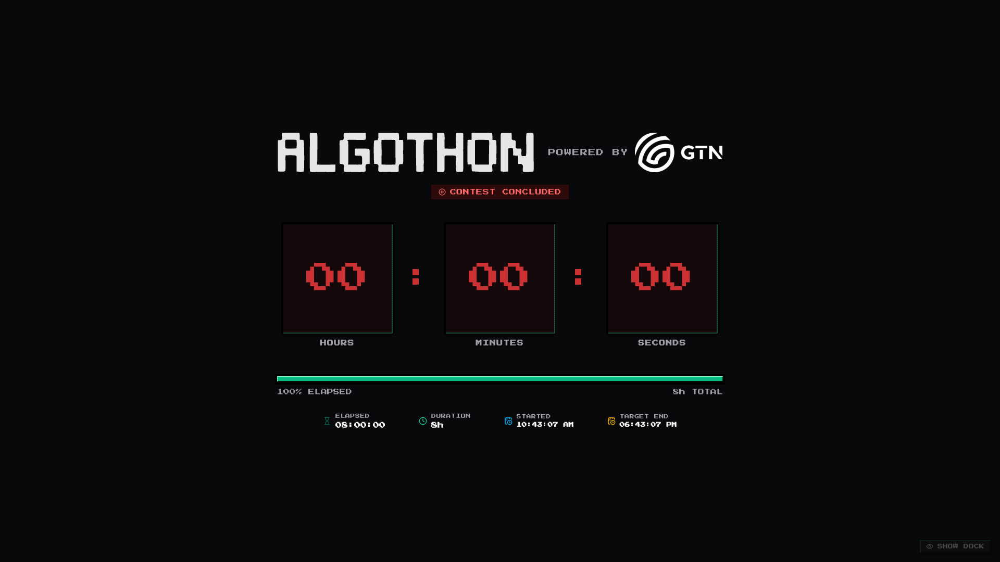
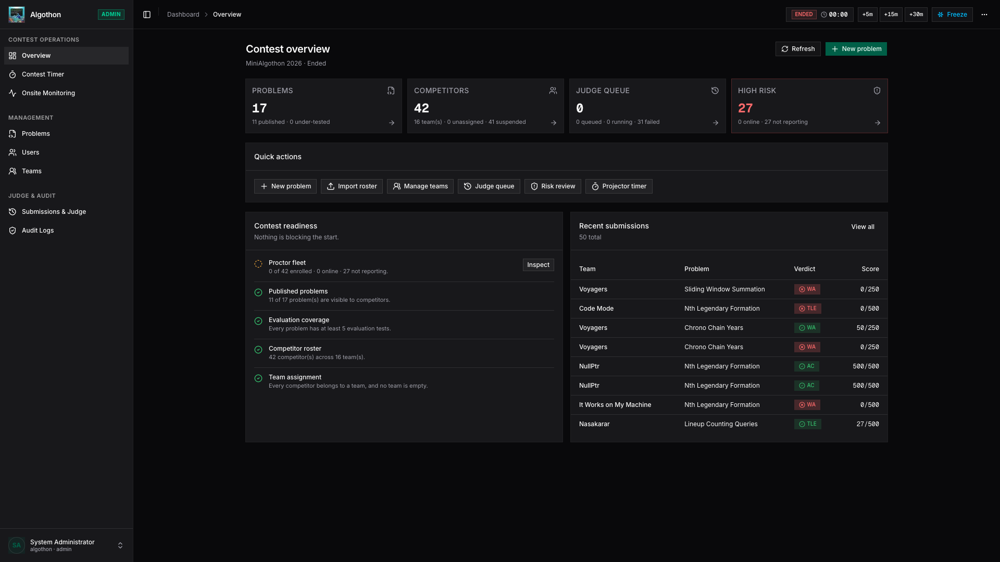
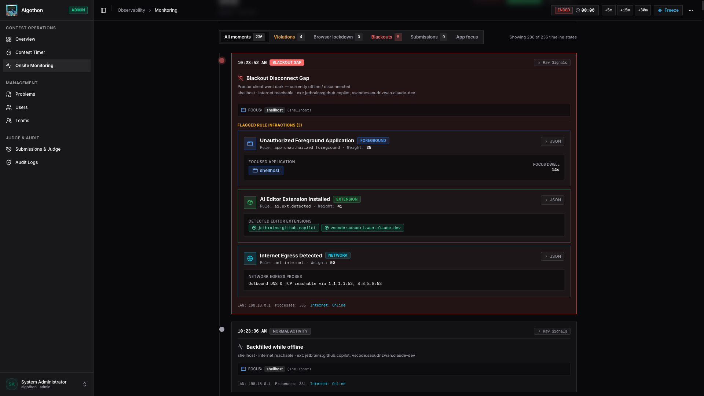
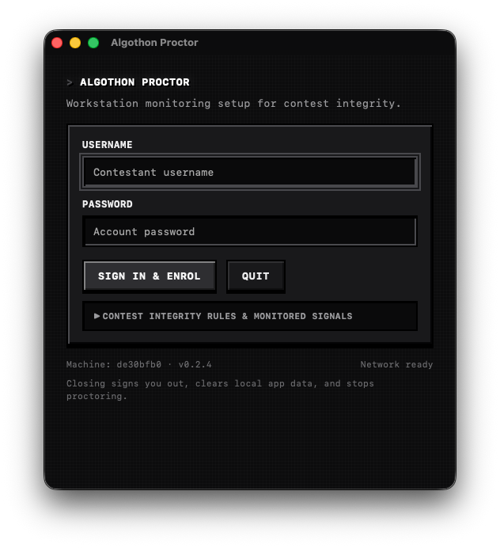
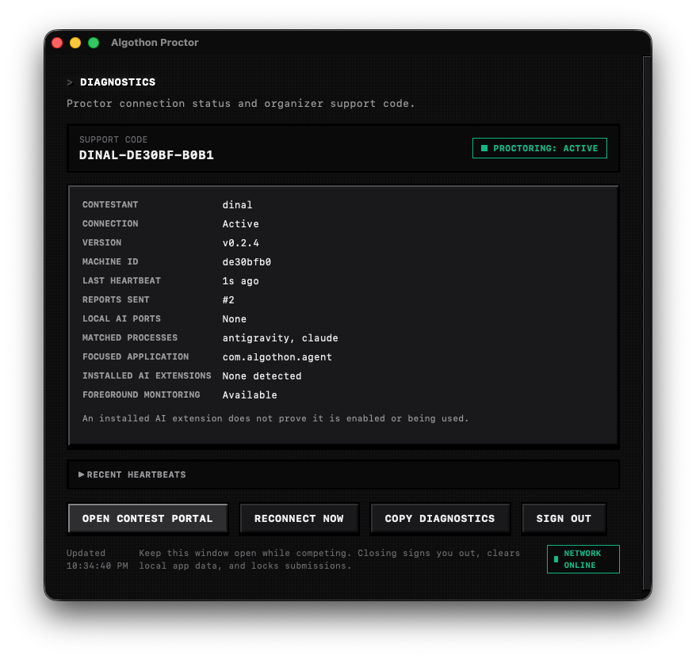

# Labyrithm

Labyrithm is a self-hosted platform for creating, running, and managing algorithmic problem-solving environments. The name combines **Labyrinth** and **Algorithm**: users navigate challenging problems while organizers manage the infrastructure, evaluation rules, and learning or assessment workflow around them.

It supports competitive programming contests, university labs, technical assessments, interview exercises, private coding challenges, and other controlled environments where untrusted code must be evaluated reliably. Labyrithm provides a secure sandboxed execution pipeline, real-time verdict and scoreboard updates, optional proctoring, and comprehensive administration without requiring a managed platform.

---

## Product Overview

Labyrithm delivers end-to-end algorithmic problem-solving infrastructure in a self-hosted package:

- **Contestants** solve challenges in a browser-based Monaco code editor, test their solutions against custom inputs, submit code, and receive real-time verdicts streamed over Server-Sent Events (SSE).
- **Proctoring** runs via a lightweight, cross-platform desktop daemon (Tauri v2 + Rust) that verifies workstation integrity through local loopback attestation without requiring intrusive kernel drivers.
- **Administrators** control contest states (start, pause, resume, extend, freeze), manage problem suites and test cases (supporting 200+ MB datasets), monitor live telemetry, and rejudge submissions on demand.
- **Judge Workers** execute untrusted code inside isolated Linux `isolate` sandboxes with strict CPU, memory, and wall-clock enforcement, acquiring tasks atomically from PostgreSQL via `FOR UPDATE SKIP LOCKED`.

## Product Tour

Labyrithm brings participant, organizer, and proctoring workflows together in one self-hosted platform.

### Competitor Experience

Browse challenges, open a problem, write code in the Monaco editor, run custom input, and follow progress on the live leaderboard.

<table>
<tr>
<td width="50%"><br><sub>Challenge list</sub></td>
<td width="50%"><br><sub>Challenge workspace</sub></td>
</tr>
<tr>
<td width="50%"><br><sub>Leaderboard</sub></td>
<td width="50%"><br><sub>Contest timer</sub></td>
</tr>
</table>

### Organizer Experience

The admin console provides contest readiness, problem and roster management, timer controls, submission review, and live proctoring telemetry.

<table>
<tr>
<td width="50%"><br><sub>Admin dashboard</sub></td>
<td width="50%"><br><sub>Proctoring monitor</sub></td>
</tr>
</table>

### Desktop Proctor

The optional desktop client runs a separate background agent for enrollment, heartbeats, diagnostics, and loopback attestation.

<table>
<tr>
<td width="50%"><br><sub>Desktop proctor setup</sub></td>
<td width="50%"><br><sub>Desktop proctor diagnostics</sub></td>
</tr>
</table>

---

## Key Capabilities

### 1. Distributed Online Judge Engine

- **Secure Sandbox Isolation**: Untrusted code executes inside the Linux `isolate` sandbox with cgroups v2 resource limits, physical CPU core affinity, transient `tmpfs` file systems, and zero network access.
- **Multi-Language Support**: Compiles and executes C++, C, Python, Java, Node.js, and Rust with language-specific timeout multipliers and memory adjustments.
- **Broker-Free Queueing**: Uses PostgreSQL as a transactional distributed job queue with `FOR UPDATE SKIP LOCKED`. Eliminates operational dependencies on external message brokers such as Redis or RabbitMQ while guaranteeing atomic job delivery and automatic crash recovery.
- **Flexible Worker Topologies**: Supports embedded in-process execution for single-server setups or horizontally scaled standalone worker nodes (`cmd/worker`) for high-concurrency competition bursts.
- **Test Case Memory**: Judge workers load problem suites on demand and share their input and expected-output bytes across submissions. `JUDGE_TEST_CACHE_MB` sets the retained payload budget (default 4096 MiB); least recently used idle suites are evicted. Active suites remain available until their submissions finish and can exceed that budget. It is not a total process memory limit: leave room for sandbox processes, temporary files, output grading, and Go heap overhead. Concurrent requests for the same suite share a load. Edits and listener reconnections invalidate cached suites; a five-minute freshness fallback reloads only requested problems if an edit notification was missed. Cold, expired, or evicted suites require a PostgreSQL read. Batch output is released after each case is graded.

### 2. Real-Time Contest Operations

- **Live Verdict Streaming**: Testcase-by-testcase results are streamed directly to contestant browsers in real time using PostgreSQL `LISTEN/NOTIFY` and Server-Sent Events (SSE).
- **Dynamic Scoreboard**: Automatically updates scores based on problem point weights and earliest submission time. Includes a configurable scoreboard freeze window to maintain suspense during contest conclusions.
- **Custom Input Playground**: Contestants can run arbitrary code against custom test inputs (up to 1 MB stdin) with automatic cooldown locks and output limit enforcement.

### 3. Integrated Anti-Cheat & Proctoring Suite

- **Split Client Architecture**: Native desktop client built with Tauri v2 and Rust separates the unprivileged web contest shell from a background agent daemon.
- **Loopback Attestation**: The web portal verifies desktop daemon presence via signed local loopback requests (`http://127.0.0.1:47615`), gating official submissions behind an active proctor session.
- **Telemetry & Risk Scoring**: Ingests window state transitions, focus losses, display counts, and process snapshots to compute a composite participant risk score in real time.
- **Paste Burst Detection**: Automatically detects and flags anomalous code paste bursts to identify unauthorized automated assistants.
- **Emergency Overrides**: Administrators can issue temporary proctor exemptions or web-only submission overrides for participants with hardware issues.

### 4. Administrative Control Console

- **Contest Control Bar**: Real-time docked timer allowing administrators to start, pause, resume, extend, freeze, or reset contests with instant global synchronization.
- **Problem Authoring & Test Suite Management**: Markdown editor with math notation, sample input/output pairs, and a chunked test case uploader capable of ingesting large test suites ($200+\text{ MB}$) test-by-test.
- **Dynamic Rejudging**: Re-evaluate individual submissions or trigger bulk problem re-evaluations with automatic leaderboard score adjustments.
- **User & Team Rosters**: Role-based access control (Competitor, Admin), multi-member team assignments, and CSV batch import utilities.
- **Immutable Audit Logging**: Every administrative action, timer change, credential reset, and score modification is logged asynchronously to an append-only audit trail.

---

## Core System Components

| Component             | Directory                                                                                                 | Primary Technology                | Default Port       | Function                                                                                    |
| --------------------- | --------------------------------------------------------------------------------------------------------- | --------------------------------- | ------------------ | ------------------------------------------------------------------------------------------- |
| **Backend Core**      | [backend/](backend)                         | Go 1.25, Gin, pgx/v5              | `8080`             | REST API, SSE streaming, submission queue, proctoring engine, and audit logger              |
| **Judge Workers**     | [backend/cmd/worker/](backend/cmd/worker)   | Go, Linux `isolate`               | N/A                | Distributed queue polling, sandbox compilation, test execution, and verdict broadcast       |
| **Competitor Portal** | [competitor-frontend/](competitor-frontend) | Next.js App Router, Monaco Editor | `3000`             | Problem viewer, code editor, custom runner, submission stream, and scoreboard               |
| **Admin Console**     | [admin-frontend/](admin-frontend)           | Next.js 15, Tailwind, shadcn/ui   | `3001`             | Contest timers, problem authoring, participant monitoring, risk dashboard, and audit viewer |
| **Desktop Client**    | [competitor-desktop/](competitor-desktop)   | Tauri v2, Rust                    | `47615` (loopback) | Background proctor daemon, process monitor, loopback attestation, and contest shell         |
| **Database**          | [backend/internal/db/](backend/internal/db) | PostgreSQL 16                     | `5432`             | Relational storage, `SKIP LOCKED` job queue, and `LISTEN/NOTIFY` pub/sub                    |
| **Observability**     | `monitoring/`                                                                                             | Prometheus, Loki, Grafana         | `3002` (local)     | Execution metrics, container logs, queue depth monitoring, and runner telemetry             |

---

## Quick Start

### 1. Prerequisites

- **Docker & Docker Compose**: Version 2.20+ with cgroup v2 support.
- **Node.js**: Version 20+ LTS and **pnpm** Version 9+.
- **Go**: Version 1.25+ (for running native tools outside Docker).
- **Rust & Cargo**: Latest stable (required only for building the desktop app).

### 2. Configure Environment Files

```sh
cp backend/.env.example backend/.env
cp competitor-frontend/.env.example competitor-frontend/.env.local
cp admin-frontend/.env.example admin-frontend/.env.local
```

### 3. Install Dependencies & Start Database

```sh
make install
make db-up
```

Database migrations apply automatically on startup.

### 4. Seed Root Administrator Account

```sh
make admin ARGS='-username admin -name "Contest Administrator" -password adminpass'
```

### 5. Start Development Services

```sh
# Option 1: Start backend API and competitor frontend concurrently
make dev

# Option 2: Start services independently in separate terminals
make backend              # Terminal 1: Go backend API (port 8080)
make competitor-frontend  # Terminal 2: Competitor portal (port 3000)
make admin-frontend       # Terminal 3: Admin management portal (port 3001)
make worker               # Terminal 4: Optional standalone judge worker daemon
```

### 6. Service Endpoints

- **Competitor Portal**: `http://localhost:3000`
- **Admin Management Console**: `http://localhost:3001`
- **Backend API**: `http://localhost:8080`
- **Swagger Documentation**: `http://localhost:8080/swagger/index.html` (when `APP_ENV=development`)

---

## Documentation Index

Detailed architectural and operational documentation is maintained in the [docs/](docs) directory:

- [System Architecture & Topology](docs/architecture.md): Complete architectural topology diagrams, submission evaluation sequence flows, proctoring attestation mechanics, and distributed locking guarantees.
- [Quick Start Guide](docs/quick-start.md): Step-by-step local workstation setup, testing commands, and environment configuration.
- [Production Deployment Guide](docs/deployment.md): Single-VM setup, horizontal worker scaling, GCE VM provisioning, TLS termination, PostgreSQL connection management, and crash recovery.
- [Competitor Desktop Application Guide](docs/desktop-app-guide.md): Tauri v2 installation, macOS Gatekeeper troubleshooting, Windows portable executable, Linux AppImage, and automated CI/CD builds.
- [Contestant Client Design & Proctoring Split](docs/client-design.md): In-depth analysis of the daemon/shell split, loopback attestation, and fail-safe web fallback mechanics.
- [Observability & Monitoring Guide](docs/monitoring.md): Prometheus metrics, Loki log pipelines, PromQL/LogQL queries, and secure remote Grafana access.
- [Backend Subsystem Documentation](backend/README.md): Detailed internal package layout, database migrations, CLI utilities, and runner specifications.

---

## License

Apache License 2.0. See [LICENSE](LICENSE) for details.

## Open-Source Project

Labyrithm is currently a beta release focused on validating the platform direction and gathering feedback from self-hosting operators, educators, and developers.

- [Contributing](contribution.md)
- [Code of Conduct](CODE_OF_CONDUCT.md)
- [Security Policy](SECURITY.md)
- [Support](SUPPORT.md)
- [Changelog](CHANGELOG.md)
