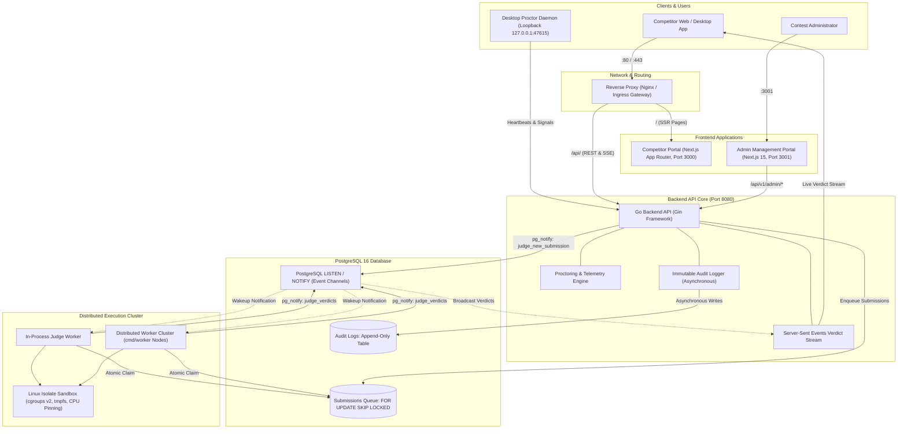

# MiniAlgothon

MiniAlgothon is a high-performance, distributed algorithmic contest and code execution platform. It features a Go backend API server with an in-process or standalone judge worker engine backed by the Linux `isolate` sandbox, Next.js competitor and administrator web applications, a cross-platform Tauri desktop proctoring client, and PostgreSQL-driven real-time event broadcasting and queue management.

---

## Architectural Topology



---

## Core System Components

| Component | Path | Technology | Default Port | Primary Function |
| --- | --- | --- | --- | --- |
| **Backend API** | [backend/](file:///Users/nayanthanethsara/Documents/Github/mini-algothon/backend) | Go 1.25, Gin, pgx/v5 | `8080` | REST API, authentication, submission ingestion, contest state machine, SSE verdict feed, proctoring engine, and audit logging |
| **Judge Workers** | [backend/cmd/worker/](file:///Users/nayanthanethsara/Documents/Github/mini-algothon/backend/cmd/worker) | Go, Isolate Sandbox | N/A | Distributed queue polling (`SKIP LOCKED`), compilation, test execution, resource monitoring, and verdict broadcasting |
| **Admin Console** | [admin-frontend/](file:///Users/nayanthanethsara/Documents/Github/mini-algothon/admin-frontend) | Next.js 15, TypeScript, Tailwind | `3001` | Contest control bar, problem authoring, user/team management, submission review, live proctoring dashboard, and audit viewer |
| **Competitor Portal** | [competitor-frontend/](file:///Users/nayanthanethsara/Documents/Github/mini-algothon/competitor-frontend) | Next.js App Router, Monaco Editor | `3000` | Problem statement reader, code editor, custom input tester, real-time submission feed, scoreboard, and announcements |
| **Desktop Client** | [competitor-desktop/](file:///Users/nayanthanethsara/Documents/Github/mini-algothon/competitor-desktop) | Tauri v2, Rust | `47615` (loopback) | Split-architecture client: background proctor daemon (`--agent`) with loopback attestation, process signals, and contest webview shell |
| **Database** | [backend/internal/db/](file:///Users/nayanthanethsara/Documents/Github/mini-algothon/backend/internal/db) | PostgreSQL 16 | `5432` | Relational storage, atomic row-level locking, event pub/sub (`LISTEN/NOTIFY`), and append-only audit trail |
| **Observability** | `monitoring/` | Prometheus, Loki, Promtail, Node Exporter, Grafana | `3002` (local) | Container logs aggregation, HTTP latency metrics, judge queue depth, runner box occupancy, and host hardware telemetry |

---

## Prerequisites

- **Docker & Docker Compose**: Version 2.20+ with cgroup v2 support enabled.
- **Node.js**: Version 20.x or higher LTS.
- **pnpm**: Version 9.x or higher.
- **Go**: Version 1.25+ (for running native commands and unit tests outside Docker).
- **Rust & Cargo**: Latest stable (required only for compiling the desktop client).

---

## Documentation Index

Detailed documentation guides are available in the [docs/](file:///Users/nayanthanethsara/Documents/Github/mini-algothon/docs) directory:

- [Quick Start Guide](file:///Users/nayanthanethsara/Documents/Github/mini-algothon/docs/quick-start.md): Local environment setup, dependencies, first admin seeding, and testing.
- [Deployment Guide](file:///Users/nayanthanethsara/Documents/Github/mini-algothon/docs/deployment.md): Production architecture, single-VM setup, multi-VM horizontal worker scaling, multi-account GCP networking, PostgreSQL connection limits, crash recovery, and security.
- [Observability & Monitoring Guide](file:///Users/nayanthanethsara/Documents/Github/mini-algothon/docs/monitoring.md): Prometheus metrics, Loki log pipelines, PromQL/LogQL queries, and secure remote Grafana tunnelling via Google Cloud IAP.
- [Competitor Desktop Application Guide](file:///Users/nayanthanethsara/Documents/Github/mini-algothon/docs/desktop-app-guide.md): Tauri v2 installation, macOS Gatekeeper troubleshooting, Windows portable executable, Linux AppImage, and automated CI/CD builds.
- [Contestant Client Design & Agent Split](file:///Users/nayanthanethsara/Documents/Github/mini-algothon/docs/client-design.md): In-depth security analysis of the daemon/shell split, loopback attestation, and fail-safe web fallback mechanics.
- [Backend Architecture Guide](file:///Users/nayanthanethsara/Documents/Github/mini-algothon/backend/README.md): Detailed internal package layout, queue mechanics, sandbox configuration, audit domain, and CLI utilities.
- [Admin Frontend Architecture Guide](file:///Users/nayanthanethsara/Documents/Github/mini-algothon/admin-frontend/README.md): Admin UI modules, server actions, route protection, and component patterns.
- [Competitor Frontend Architecture Guide](file:///Users/nayanthanethsara/Documents/Github/mini-algothon/competitor-frontend/README.md): Contestant web portal, Monaco integration, SSE stream consumption, and telemetry bridge.

---

## Quick Start

### 1. Configure Environment Files

```sh
cp backend/.env.example backend/.env
cp competitor-frontend/.env.example competitor-frontend/.env.local
cp admin-frontend/.env.example admin-frontend/.env.local
```

### 2. Install Dependencies & Start Database

```sh
make install
make db-up
```

The database applies all embedded schema migrations automatically on startup. To execute migrations explicitly without launching the server, run `make migrate`.

### 3. Seed the Root Administrator

The administrator console requires an existing administrator account. Create the root administrator directly via the CLI tool:

```sh
make admin ARGS='-username admin -name "System Administrator" -password adminpass'
```

Further administrators, problem authors, competitor accounts, and teams are created and managed within the Admin Portal.

### 4. Run Application Services

```sh
# Option 1: Start backend API and competitor frontend concurrently
make dev

# Option 2: Start services in separate terminals
make backend              # Terminal 1: Go backend API (port 8080)
make competitor-frontend  # Terminal 2: Competitor portal (port 3000)
make admin-frontend       # Terminal 3: Admin management portal (port 3001)
make worker               # Terminal 4: Optional standalone judge worker daemon
```

### 5. Access Endpoints

- **Backend API**: `http://localhost:8080`
- **Swagger Documentation**: `http://localhost:8080/swagger/index.html` (in `development` mode)
- **Competitor Portal**: `http://localhost:3000`
- **Admin Management Console**: `http://localhost:3001`
- **Public Informational Pages**: `http://localhost:3001/support`, `http://localhost:3001/privacy`, `http://localhost:3001/contact`

---

## CLI Utilities Reference

The backend provides several specialized command-line tools located in [backend/cmd/](file:///Users/nayanthanethsara/Documents/Github/mini-algothon/backend/cmd):

| Binary | Directory | Purpose | Usage Example |
| --- | --- | --- | --- |
| `server` | `cmd/server` | Primary HTTP API and optional in-process judge worker | `go run ./cmd/server` |
| `worker` | `cmd/worker` | Standalone execution worker for horizontal scaling | `go run ./cmd/worker -workers 8` |
| `migrate` | `cmd/migrate` | Standalone database migration runner | `make migrate` |
| `usertool` | `cmd/usertool` | Administrative account seeding and password resets | `make admin ARGS='-username admin -password secret'` |
| `judgetest` | `cmd/judgetest` | Sandbox security, resource limits, and burst load harness | `make judgetest ARGS='-username user1 -password pass -burst 20'` |
| `proctorsim` | `cmd/proctorsim` | Proctoring telemetry generator and violation simulator | `go run ./cmd/proctorsim -agents 50 -events 200` |
| `submissionstress` | `cmd/submissionstress` | High-throughput submission ingestion load tester | `go run ./cmd/submissionstress -rate 50 -duration 60s` |

---

## Complete API Route Reference

### System & Authentication

| Method | Endpoint | Access Level | Description |
| --- | --- | --- | --- |
| `GET` | `/healthz` | Public | Health check and database connectivity verification |
| `POST` | `/api/v1/auth/login` | Public | Authenticates user credentials (subject to brute-force lockout) |
| `POST` | `/api/v1/auth/logout` | Authenticated | Terminates active session and invalidates token |
| `GET` | `/api/v1/me` | Authenticated | Returns authenticated user profile and team details |
| `POST` | `/api/v1/me/password` | Authenticated | Updates current user password |

### Competitor Contest & Submissions

| Method | Endpoint | Access Level | Description |
| --- | --- | --- | --- |
| `GET` | `/api/v1/contest` | Authenticated | Returns contest status, schedule, and client settings |
| `GET` | `/api/v1/problems` | Authenticated | Lists published contest problems |
| `GET` | `/api/v1/problems/:slug` | Authenticated | Fetches detailed problem statement and sample test cases |
| `POST` | `/api/v1/run` | Authenticated | Executes untrusted code against custom stdin or sample test |
| `POST` | `/api/v1/submissions` | Authenticated | Submits solution for official distributed evaluation (gated by proctor) |
| `GET` | `/api/v1/submissions/:id` | Authenticated | Retrieves submission status, test case breakdown, and verdict |
| `GET` | `/api/v1/submissions/stream` | Authenticated | Server-Sent Events (SSE) feed for live real-time verdicts |
| `GET` | `/api/v1/scoreboard` | Authenticated | Fetches contest scoreboard (subject to freeze state) |

### Proctoring & Telemetry

| Method | Endpoint | Access Level | Description |
| --- | --- | --- | --- |
| `POST` | `/api/v1/agent/enroll` | Public / Token | Enrolls a desktop proctor client and issues an agent bearer token |
| `POST` | `/api/v1/agent/heartbeat` | Agent Only | Ingests client heartbeat, process list, and active window signals |
| `POST` | `/api/v1/agent/shutdown` | Agent Only | Reports graceful proctor shutdown to prevent false evasion flags |
| `POST` | `/api/v1/telemetry/events` | Authenticated | Ingests web client focus, blur, and full-screen state transitions |
| `GET` | `/api/v1/proctor/disclosure` | Public | Fetches current privacy disclosures and telemetry consent text |

### Administration Management

| Method | Endpoint | Access Level | Description |
| --- | --- | --- | --- |
| `GET` | `/api/v1/admin/audit-logs` | Admin Only | Queries immutable audit log entries with dynamic filters and pagination |
| `GET` | `/api/v1/admin/users` | Admin Only | Lists all registered accounts with role and lockout status |
| `POST` | `/api/v1/admin/users` | Admin Only | Creates an individual user account |
| `POST` | `/api/v1/admin/users/bulk` | Admin Only | Bulk imports accounts from CSV |
| `DELETE` | `/api/v1/admin/users/:id` | Admin Only | Deletes account (protected: admin accounts cannot be deleted) |
| `POST` | `/api/v1/admin/users/:id/suspend` | Admin Only | Suspends account (protected: admin accounts cannot be suspended) |
| `POST` | `/api/v1/admin/users/:id/restore` | Admin Only | Restores suspended account |
| `POST` | `/api/v1/admin/users/:id/reset-password`| Admin Only | Resets account password |
| `PATCH`| `/api/v1/admin/users/:id/access` | Admin Only | Grants web-only fallback submission access override |
| `PATCH`| `/api/v1/admin/users/:id/exemption` | Admin Only | Sets temporary proctoring exemption window |
| `GET` | `/api/v1/admin/teams` | Admin Only | Lists all teams and assigned members |
| `POST` | `/api/v1/admin/teams` | Admin Only | Creates a competition team |
| `DELETE`| `/api/v1/admin/teams/:id` | Admin Only | Disbands a competition team |
| `POST` | `/api/v1/admin/contest/start` | Admin Only | Initiates the competition countdown/start |
| `POST` | `/api/v1/admin/contest/pause` | Admin Only | Pauses competition timer and halts submission queue |
| `POST` | `/api/v1/admin/contest/resume` | Admin Only | Resumes paused competition |
| `POST` | `/api/v1/admin/contest/freeze` | Admin Only | Freezes public scoreboard updates |
| `POST` | `/api/v1/admin/contest/unfreeze` | Admin Only | Unfreezes and recalculates final scoreboard |
| `POST` | `/api/v1/admin/contest/reset` | Admin Only | Resets competition timer, submissions, and scores |
| `POST` | `/api/v1/admin/submissions/:id/rejudge` | Admin Only | Re-evaluates a single submission |
| `POST` | `/api/v1/admin/problems/:id/rejudge` | Admin Only | Re-evaluates all submissions for a problem |
| `GET` | `/api/v1/admin/monitoring` | Admin Only | Real-time participant grid, risk scores, and active agents |

---

## Security Architecture

- **Separated Session Lifetimes**: Administrator sessions expire in 12 hours (`ADMIN_SESSION_TTL_HOURS=12`). Competitor sessions expire in 3 hours (`SESSION_TTL_HOURS=3`).
- **Brute-Force Account Lockout**: Five consecutive failed login attempts on a username trigger an automatic 15-minute lockout.
- **Root Administrator Immutability**: Protected against accidental or malicious deletion, role demotion, suspension, or web-based password resets.
- **Immutable Audit Logging**: Non-blocking asynchronous logging captures every sensitive administrative and authentication action to PostgreSQL.
- **Search Engine De-indexing**: Internal administrative and contestant routes enforce `noindex, nofollow` headers and `robots.txt` exclusion.
- **Sandboxed Execution**: Submissions execute within Linux `isolate` control groups with zero network access, memory caps, strict wall-clock time limits, and CPU pinning.

---

## License

MIT License. See `LICENSE` for details.
