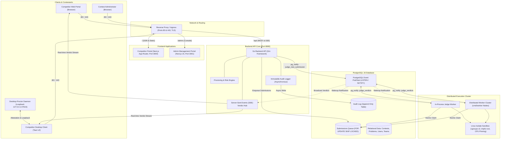
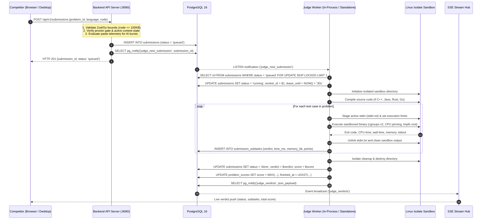
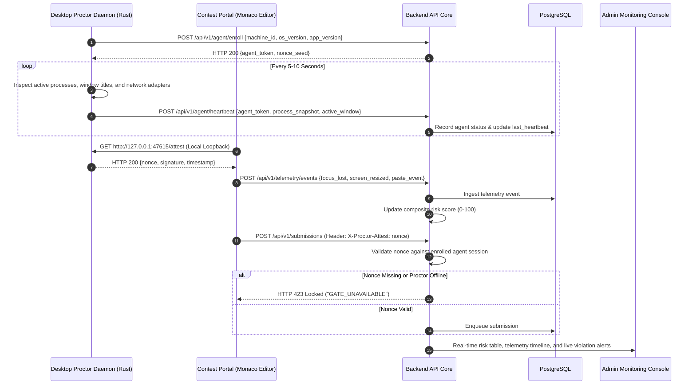

# System Architecture & Topology

This document describes the technical architecture, distributed data flow, security model, and execution pipeline of Labyrithm.

---

## 1. System Topology

---

## 2. Submission & Evaluation Lifecycle

Labyrithm uses PostgreSQL as a transactional, distributed job queue. This architecture provides ACID guarantees, atomic task claims, and crash recovery without requiring Redis or RabbitMQ brokers.

---

## 3. Proctoring & Attestation Data Flow

To support integrity workflows without relying solely on intrusive kernel drivers, Labyrithm deploys a split-architecture model: a native background daemon communicates with the portal via local loopback attestation, while the backend continuously computes an anomalous risk score.

---

## 4. Key Architectural Guarantees

### Database-Driven Queuing (`SKIP LOCKED`)

- Multiple workers (both in-process and distributed `cmd/worker` instances) poll the same `submissions` table concurrently.
- Using PostgreSQL `FOR UPDATE SKIP LOCKED`, workers atomically acquire queued submissions without locking each other or causing database contention.
- Worker leases (`lease_until`) are refreshed during execution. If a worker node crashes or loses power, a background reaper process resets expired leases back to `queued` for immediate reassignment.

### Linux Isolate Sandbox Isolation

- Code execution runs inside the Linux `isolate` sandboxing framework.
- **CPU Pinning**: Workers bind executions to designated physical CPU cores.
- **Filesystem Isolation**: Code runs inside an isolated root filesystem with a transient `tmpfs` directory. Untrusted processes have no visibility into the host or adjacent sandboxes.
- **Network Isolation**: All loopback and external network sockets are disabled inside the sandbox.
- **Per-Test Staging**: Test case inputs are staged one at a time and unlinked immediately after each run to prevent sandboxed code from inspecting subsequent test inputs.
- **Output Bounds**: The sandbox enforces a hard $4\text{ MB}$ limit (`fsize = 4 MB`) on standard output. Output exceeding this limit terminates with `SIGXFSZ` (Output Limit Exceeded).

### Real-Time Event Fan-Out (PostgreSQL LISTEN / NOTIFY)

- PostgreSQL `pg_notify` broadcasts state transitions (`judge_new_submission`, `judge_verdicts`, `contest_state_changed`).
- API instances subscribe to these channels and stream live updates to connected browsers using persistent Server-Sent Events (SSE).
- This eliminates polling overhead on client browsers and supports high concurrent contestant volumes.

### Asynchronous Immutable Audit Trail

- Administrative actions (timer changes, user suspensions, password resets, manual score adjustments) are emitted to an in-memory channel.
- An asynchronous background worker batches and commits entries to an append-only `audit_logs` table, preventing audit operations from blocking critical request paths.
